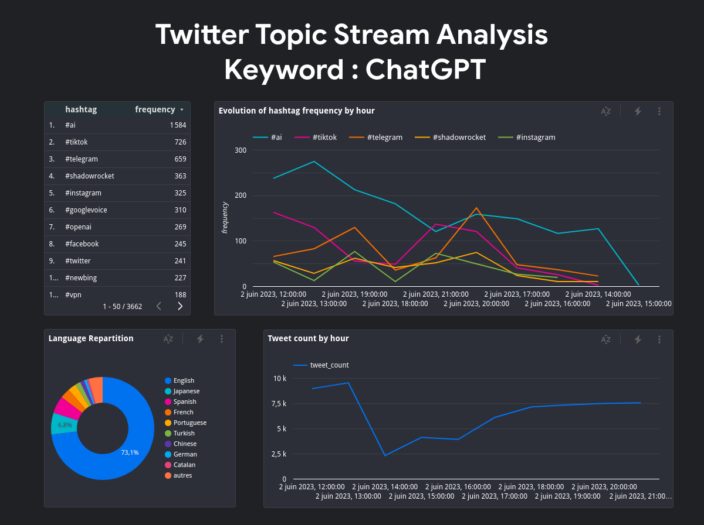
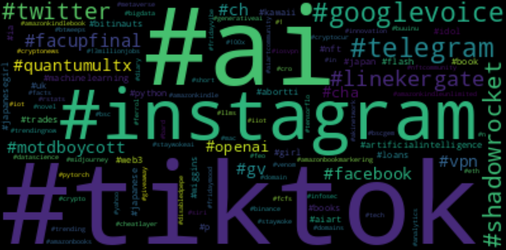

# twitter_stream_analysis

## Description :

## Objective

The project will stream the twitter api and create a data pipeline that consumes the real-time data. The data coming in is about tweet and its associated user. The data will be processed in real-time and stored to the data lake periodically (every two minutes). The hourly batch job will then consume this data, apply transformations, and create the desired tables for our dashboard to generate analytics. We will try to analyze trendings and language used on a certain topic.

## Dataset

I used the twitter api to stream data with tweepy.

## Tools & Technologies

- Cloud - [**Google Cloud Platform**](https://cloud.google.com)
- Infrastructure as Code software - [**Terraform**](https://www.terraform.io)
- Containerization - [**Docker**](https://www.docker.com), [**Docker Compose**](https://docs.docker.com/compose/)
- Stream Processing - [**Kafka**](https://kafka.apache.org), [**Spark Streaming**](https://spark.apache.org/docs/latest/streaming-programming-guide.html)
- Orchestration - [**Airflow**](https://airflow.apache.org)
- Transformation - [**dbt**](https://www.getdbt.com)
- Data Lake - [**Google Cloud Storage**](https://cloud.google.com/storage)
- Data Warehouse - [**BigQuery**](https://cloud.google.com/bigquery)
- Data Visualization - [**Data Studio**](https://datastudio.google.com/overview)
- Language - [**Python**](https://www.python.org)

## Architecture

## Final Result

### Dashboard made with Looker Studio

It will automatically update when fresh data are appended to the bigquery tables.

### Wordcloud made with python library wordcloud

## Setup

You will need a GCP account with terraform setup.

You can find all the related setup files in the setup folder of the project.